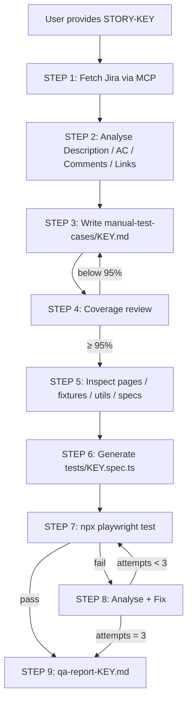

# Jira-to-Playwright Agent — Workflow Diagram

## Commands

| Action | Command |
|--------|---------|
| Full agent | `@jira-to-playwright-agent Run full pipeline for KEY` |
| Run story tests | `npx playwright test tests/KEY.spec.ts --project=chromium` |
| Per-step prompts | `.cursor/prompts/step*.md` |
