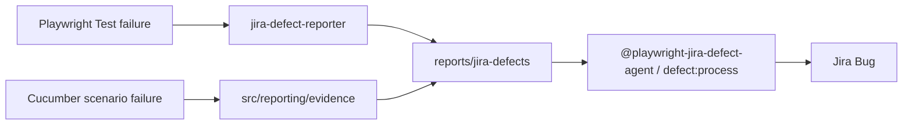

# Playwright + Cucumber Hybrid Automation Framework

Enterprise hybrid test automation for Revance (loyalty + OCE Experience Cloud), with optional SauceDemo multi-user session demos.

## Architecture at a glance

| Runner | Use when | Entry |
|--------|----------|--------|
| **Cucumber (BDD)** | Business-readable Gherkin acceptance flows (welcome, signup, enrollment, treatment) | `npm test`, `features/*.feature` |
| **Playwright Test** | Jira story automation (BL10-*), OCE UI contracts, traces, retries, multi-user sessions, defect packaging | `npm run test:pw`, `tests/**/*.spec.ts` |

**Rule of thumb**

- Cucumber = acceptance language for BA/QA
- Playwright Test = engineering-grade execution (fixtures, global setup, reporters, Jira defects)
- **One POM home:** `src/pages/` (OCE/loyalty) and `src/pages/saucedemo/` (demo app)

```
features/                 # Gherkin + step-definitions (Cucumber)
tests/                    # Playwright Test specs
  api/                    # APIRequestContext-only suites
  network/                # page.route error-state mocking demos
  file-transfer/          # Upload / download UI specs
src/
  pages/                  # Canonical Page Objects
    components/           # Reusable UI components (forms, identity fields)
    saucedemo/            # SauceDemo Login / Inventory / Cart
  fixtures/               # OCE fixtures (index) + session fixtures (session.ts)
  session/                # SessionManager, users.config, globalSetup
  hooks/                  # Cucumber World + Before/After (parallel-safe)
  reporting/              # Shared Cucumber ↔ defect evidence helpers
  config/                 # env.dev / env.qa / env.prod
  api/                    # ApiClient + loyalty enrollment hybrid
  network/                # routeMocks (500 / delay / abort)
testdata/                 # Sample files for upload tests
downloads/                # Runtime download artifacts
utils/                    # sessionStore, fileTransfer, defect helpers
reporters/                # Playwright jira-defect-reporter
```

## When to use which runner

### Cucumber
- Tag-driven suites already owned by the team (`@smoke`, `@signup`, `@completeprofile`, …)
- Flows that must stay human-readable in Gherkin
- Parallel scenarios via `npm run test:parallel` (World-isolated browser per scenario)

### Playwright Test
- Automating a Jira story end-to-end (`tests/BL10-*.spec.ts`)
- Need traces, HTML report, retries, `authenticatedPage` fixture
- Multi-user SauceDemo sessions / Chrome → Edge reuse
- Defect packages under `reports/jira-defects/` for `@playwright-jira-defect-agent`

## Page Objects (canonical)

Add new screens under `src/pages/` (or `src/pages/saucedemo/` for the demo app). Export from `src/pages/index.ts`.

```ts
import { OcePortalPage, StaffMembersPage } from '../src/pages';
```

Do **not** create a second root `pages/` folder.

**Component POM:** reusable widgets live in `src/pages/components/` (e.g. `PhoneOtpFormComponent`, `StaffIdentityFieldsComponent`). Pages extend `BasePage` and compose components instead of inlining every locator.

## API-only & network mocking

| Command | What it runs |
|---------|----------------|
| `npm run test:api` | `tests/api` via `--project=api` (`APIRequestContext` + `ApiClient`) |
| `npm run test:network-mocks` | `tests/network` — `page.route` 500 / delay / abort demos |
| `npm run test:api-enrollment` | Cucumber hybrid: API enroll → UI Home (existing) |

Helpers: `src/api/ApiClient.ts`, `src/network/routeMocks.ts`.

## File upload & download

| Command | What it runs |
|---------|----------------|
| `npm run test:file-transfer` | Upload (ExpandTesting) + Download (the-internet) on chromium |
| `npm run test:file-transfer:headed` | Same suite with visible browser |

| Resource | Path |
|----------|------|
| Utilities | `utils/fileTransfer.ts` (`uploadFile`, `downloadFile`, `verifyFileExists`, `verifyFileSize`) |
| Test data | `testdata/uploads/sample-upload.txt` |
| Downloads | `downloads/` (runtime; gitignored) |
| Page objects | `FileUploadPage`, `FileDownloadPage` |
| Specs | `tests/file-transfer/` |

## Fixtures

| Import | Purpose |
|--------|---------|
| `import { test, expect } from '../src/fixtures'` | OCE / loyalty / Jira specs (`authenticatedPage`, page objects) |
| `import { test, expect } from '../src/fixtures/session'` | SauceDemo roles (`adminPage`, `managerPage`, `asRole`, …) |

Do not mix both fixture `test` objects in the same spec file.

## Session management (SauceDemo)

- Credentials: `src/session/users.config.ts` (env-first)
- Storage: `playwright/.auth/users/{userId}.storage.json`
- `globalSetup` prepares sessions unless skipped

### When globalSetup runs / skips

| Condition | Behavior |
|-----------|----------|
| `SKIP_MULTI_USER_SESSION_SETUP=true` | Always skip |
| `EDIT_STAFF_E2E=true` (and setup not forced) | Skip (OCE-only) |
| `MULTI_USER_SESSION_SETUP=true` | Force run |
| Projects `chrome-setup` / `msedge-reuse` / `ExecutionSuite-*` | Run |
| Default `playwright test` | Run (so multi-user fixtures work) |

OCE live example (no SauceDemo setup):

```powershell
$env:TEST_ENV='qa'; $env:EDIT_STAFF_E2E='true'
npx playwright test tests/BL10-550.spec.ts --project=chromium --headed --workers=1
```

**ExecutionSuite** (BL10-550 + multi-user + Chrome save + Edge reuse) — preferred single command.
Uses opt-in projects (`EXECUTION_SUITE=true`) so default `npm run test:pw` is unchanged:

```powershell
npm run test:execution-suite:headed
```

Headless equivalent: `npm run test:execution-suite`

Session Chrome → Edge only:

```powershell
npm run test:session-chrome-edge
```

See also `docs/MULTI_USER_SESSION.md`.

## Local execution

```bash
npm install
npx playwright install chromium

# Cucumber
npm test
npm run test:welcome
npm run test:completeprofile
npm run test:api-enrollment
npm run test:parallel

# Playwright Test
npm run test:pw
npm run test:pw:oce
npm run test:multi-user
npm run test:execution-suite:headed

# Environment
set TEST_ENV=qa   # Windows
```

## Parallel execution

- **Cucumber:** `npm run test:parallel` — each scenario gets its own Browser/Context/Page on `PlaywrightWorld` (no module-level `page`).
- **Playwright Test:** workers via `playwright.config.ts`; session fixtures use worker-scoped `SessionManager` + file locks.

## Reporting & Jira defects



| Runner | Screenshots | Traces | Defect JSON |
|--------|-------------|--------|-------------|
| Playwright Test | on failure | retain-on-failure | `reporters/jira-defect-reporter.ts` |
| Cucumber | AfterStep + evidence helper | N/A (Allure attachments) | `src/reporting/evidence.ts` → same `reports/jira-defects/` |

Process pending packages:

```bash
npm run defect:process
```

Or ask Cursor: `@playwright-jira-defect-agent` with `reports/jira-defects/latest.json`.

Allure (Cucumber):

```bash
npm run allure:generate
npm run allure:open
```

## Adding a new Page Object

1. Create `src/pages/MyScreenPage.ts` (or under `saucedemo/`)
2. Export from `src/pages/index.ts`
3. Register in `src/fixtures/index.ts` if Playwright specs need a fixture
4. Reuse from Cucumber steps via `new MyScreenPage(this.requirePage())`

## Adding a new Cucumber feature

1. Add `features/my.feature`
2. Add steps in `features/step-definitions/`
3. Type `this` as `PlaywrightWorld` and call `this.requirePage()`
4. Tag and wire an npm script if needed

## Adding a new Playwright spec (Jira)

1. Prefer `@jira-to-playwright-agent` pipeline
2. Spec under `tests/{KEY}.spec.ts`
3. `import { test, expect } from '../src/fixtures'`
4. Reuse `src/pages` — no duplicate POMs

## CI/CD guidance

Suggested matrix:

1. `TEST_ENV=qa npm test` — Cucumber smoke/regression tags
2. `npm run test:pw` with `MULTI_USER_SESSION_SETUP` only on session jobs
3. OCE job: `EDIT_STAFF_E2E=true` + secrets for OCE credentials
4. Publish `playwright-report/`, `reports/report.html`, `reports/jira-defects/`

## Agents

See `AGENTS.md`:

- `jira-to-playwright-agent` — story → manual cases → specs → heal → QA report
- `playwright-jira-defect-agent` — failure package → Jira Bug (product bugs only)

---

**Maintained for hybrid Cucumber + Playwright Test.** Prefer incremental changes; keep POM and fixtures under `src/`.
